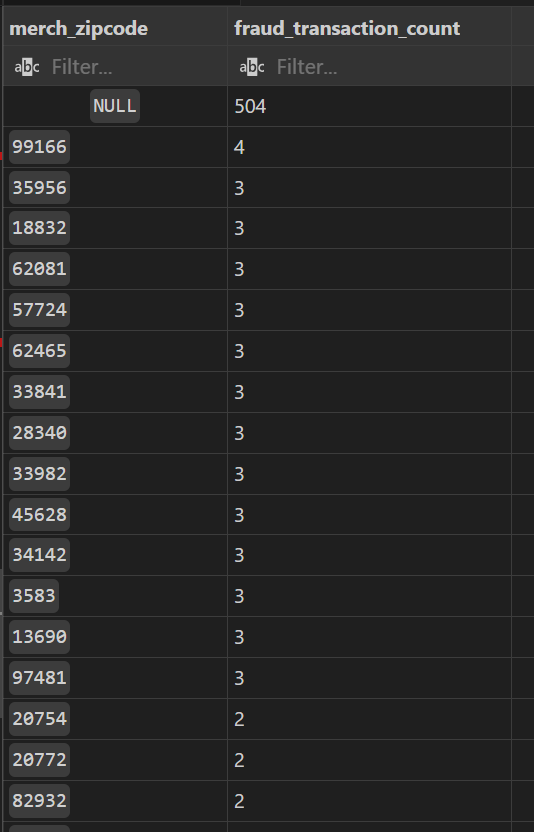

# Project background
As digital payments become increasingly common, credit card fraud has emerged as a serious financial and data security problem.
While many institutions use machine learning models to detect fraud in real time, understanding the underlying behavioral patterns behind fraudulent activities is just as important.

This project focuses on exploring and analyzing fraud patterns using SQL, not predicting or flagging individual fraudulent transactions.
The goal is to understand how fraudulent behaviors differ from normal user behavior in terms of transaction frequency, timing, amount, and merchant characteristics.
# Data Structure & Initial Checks
The dataset contains credit card transactions made by European cardholders in September 2013, sourced from Kaggle. 
Originally, it was provided as a single raw file containing transaction details such as timestamps, amounts, card numbers, merchant information, and fraud labels. 

To make the data more structured and realistic for SQL analysis, I normalized the dataset into four related tables, as shown below: (Because the transaction_info file is too large so i leave a link to google drive here [link](https://drive.google.com/drive/folders/1jhxP1ch6Ckkyw43Nqp5XdZRpwDcY9xgd?usp=sharing)

# Methodology 
1. First, I use Excel to normalize the large single file dataset into four related tables. Due to the capacity of excel, I have to reduce the number of rows to half by keeping the the first 500000 rows.
2. Then, I write SQL queries to analyze the pattern of fraudulent transactions.
# Skills
Excel: Power Query Editor, data modeling

SQL: CTEs, Joins, Case, Aggregate functions, Window Functions
# Executive Summary
### Overview of Findings
- Time-Based Insights:

Fraud peaks late at night (10 PM–12 AM), indicating reduced monitoring.
Significant drop in fraud incidents during working hours (8 AM–5 PM).
- Category-Based Insights:

Highest fraud rate in online shopping transactions (1.74%).
Lowest fraud rate in home transactions (0.12), showcasing lower risk for in-person activities.
- Amount-Based Insights:

High-value transactions (>€500) have a critical fraud rate of 23.91%.
Moderate risk in mid-value transactions (€100–500) at 1.02%.
Very low risk in small transactions (<€100) with rates around 0.17%–0.18%.
- Location-Based Insights:

Fraud occurs frequently in areas without ZIP codes, suggesting exploitation of location verification gaps.
# Insights Deep Dive
### Time-based
Fraud spikes late at night (especially around 10 PM–12 AM) then, when monitoring or user activity may be lower — a common pattern in fraud behavior. Then it gradually declines toward dawn till 3 AM.

There’s a noticeable dip during regular working hours (8 AM–5 PM), suggesting that fraudsters exploit off-peak times.

### Category-based
Highest fraud rate: shopping_net — 1.74%, meaning online shopping transactions have the greatest fraud risk.

Lowest fraud rate: home — only 0.12%, suggesting low-risk activity in this category.

Online transactions (shopping_net, grocery_net, misc_net) show notably higher fraud rates than point-of-sale (POS) or in-person transactions.
This pattern aligns with general fraud trends — digital channels are easier for fraudsters to exploit.

Fraud detection systems should prioritize online merchant monitoring, especially in the shopping-related segments.

### Amount-based
The analysis of the fraud rate reveals a highly skewed risk distribution, where larger transactions have a dramatically higher chance of being fraudulent:

Extreme Risk in High-Value Transactions: The > €500 amount range has an overwhelming 23.91% fraud rate. This means that nearly one out of every four transactions above €500 is fraudulent. This highlights that this range represents a critical, high-risk area requiring the most stringent security measures.

Moderate Risk in Mid-Value Transactions: The €100–500 range presents a moderate but significant risk with a 1.02% fraud rate. This is approximately five to six times higher than the fraud rates of the two lowest ranges, suggesting that fraudsters frequently target this bracket as well.

Very Low Risk in Small Transactions: Both the < €10 and €10–100 ranges have very low and similar fraud rates, at 0.17% and 0.18% respectively. While these ranges contain the vast majority of all transactions (over 400,000 combined), they have the lowest inherent risk of fraud per transaction.

### Location-based 

Many fraudulent happening in places without zipcode which could indicate that Fraudsters often exploit loopholes in systems that do not adequately verify locations. If fraudulent activities are concentrated in areas with unreliable location data, it’s essential to analyze these trends to identify patterns.

